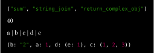

# Jogs

Quickjs javascript runtime for typst. This package provides a typst plugin for evaluating javascript code.

## Example

```typst
#import "@preview/jogs:0.1.0": *

#show raw.where(lang: "jogs"): it => eval-js(it)

```jogs
function fib(n) {
  if (n < 2) return n;
  return fib(n - 1) + fib(n - 2);
}
res = []
for (let i = 0; i < 10; i++) {
  res.push(fib(i))
}
res
```

result: 


